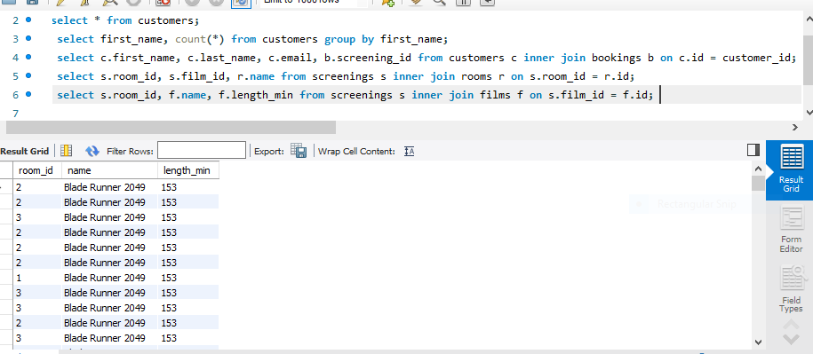

## Hi there 👋
I am a software tester
# 👋 Hi, I'm **(GANIYU AYOMIDE)**
**Software Tester | QA Enthusiast | Bug Hunter**

I’m passionate about ensuring software works flawlessly by breaking things in the smartest way possible. I test with intention, report with clarity, and collaborate with teams to help ship reliable, user-friendly products.

---

## 🔍 What I Do
- Manual testing (functional, regression, exploratory)
- Writing clear, reproducible bug reports
- Creating and executing test cases
- Web & mobile application testing
- Basic automation (Selenium / Postman / API testing if applicable / CYPRESS / SQL)
- Collaborating with developers to resolve issues

---

## 📂 Portfolio

### **🧪 Test Case Collections**
A curated set of test cases I’ve written for different scenarios and products.  
➡️ *JIJI TESTCASE LINK /  https://docs.google.com/spreadsheets/d/1B6xMEZcrE-MbvAeZrkRW6FwLZQl80879J1eCxDJnQew/edit?gid=1334334218#gid=1334334218

---

### **🐞 Bug Reports Samples**
Realistic example bug reports following industry-standard formats.  
➡️ *Bug report on jiji account creation page / https://docs.google.com/spreadsheets/d/1PL29q0QyBSjgF8Lhnx_EurCFgn2qRYg1EBEu4-P_g7E/edit?gid=1923870747#gid=1923870747

---

### **🔧 Tools I Use**
- Jira / Trello  
- Postman  
- Selenium  
- Git & GitHub  
- Browser DevTools  
- TestRail

---

## 📘 Sample Projects

### **Project 1: Web App Functional Testing**
- Wrote structured test cases.
- Performed regression & exploratory testing.
- Logged defects with detailed reproduction steps and screenshots.
- **Repo:** https://github.com/Ayomide254/TASKS-SELENIUM/blob/master/src/main/java/org/example/FinalProject.java

### **Project 2: API Testing with Postman**
- Tested various endpoints.
- Validated responses, headers, status codes.
- Designed automated test collections.
- **Repo:** https://github.com/Ayomide254/postman-API/blob/main/Postman%20Collections/group_c.json
- **Repo:** https://github.com/Ayomide254/postman-API-testing/blob/main/Postman%20Collections/postman_api_testing.json

- ### *Project 3: SQL** 
- 

### **Project 3: Mobile App Testing**
- Performed UI/UX inspection.
- Documented issues across device types.
- **Repo:** https://docs.google.com/spreadsheets/d/17goLbequqBW--7jWw6QCOCO83ETCsVW6TAwkd5Vq2Jg/edit?usp=sharing

- Other Selenium Repos
-**Repo:** https://github.com/Ayomide254/SELENIUM_-CODES-/blob/master/src/humanBeing.java
  **Repo:** https://github.com/Ayomide254/MODULE-4-java/tree/master/src/main/java/org/example
  **Repo:** https://github.com/Ayomide254/TASKS-SELENIUM/tree/master/src/main/java/org/example
   
---

## 🎯 About Me
I enjoy digging into systems, understanding how they work, and spotting issues early before they become expensive problems. My goal is to become a well-rounded QA Engineer and contribute to products that people actually enjoy using.

---

## 📫 Contact Me
- **Email:** Ayomideganiyu247@gmail.com
- **LinkedIn:** * https://www.linkedin.com/in/ayomide-ganiu-7b24a4370/  

---

Thanks for checking out my portfolio!  
Feel free to explore my repos and drop feedback. 

